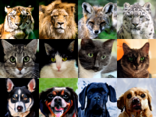
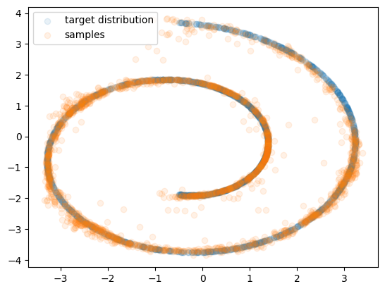
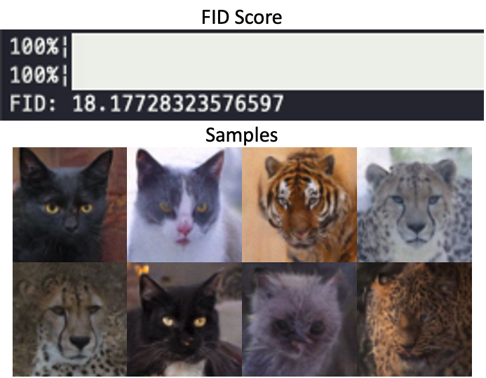

# Denoising Diffusion Implicit Models (DDIM) & Classifier-Free Diffusion Guidance (CFG)

<div align="center">
  
</div>

This repository demonstrates **Denoising Diffusion Implicit Models (DDIM)** and **Classifier-Free Diffusion Guidance (CFG)**, extending a foundational Denoising Diffusion Probabilistic Model (DDPM) setup from prior work. It explores two main challenges:

1. **Accelerating the sampling process** (DDIM) without the need to retrain from scratch.  
2. **Conditional image generation** (CFG) using a simple yet powerful guidance method.

> **Note**: Much of this code is adapted from materials originally developed by **Minhyuk Sung**, **Seungwoo Yoo**, and other contributors to the KAIST CS492(D) course. This project is intended for learning and experimentation. Please see the [Credits](#credits) section for complete acknowledgments.

---

## Overview

### 1. DDIM for Fast Sampling

While DDPMs typically require hundreds of denoising steps to produce a sample, **DDIM** [1] offers a method to **significantly reduce** the number of sampling steps—**without retraining**. By tweaking the sampling algorithm, you can generate high-quality samples much faster than a standard DDPM-based sampler.

**Key Concept**:  
- In DDPM, the sampling steps are tied to a fixed Markov chain with forward and reverse processes.  
- In DDIM, we modify the reverse process formula to skip steps, reducing the total number of iterations.

### 2. Classifier-Free Diffusion Guidance (CFG)

CFG [2] tackles **conditional generation**. In real-world applications, we often want to control the generation process—for instance, specifying a class label (“cat,” “dog,” “wildlife”) to guide the model’s output.

**Key Concept**:
- During training, we randomly replace class labels with a null (or “unconditional”) label.  
- During inference, we fuse the conditional and unconditional predictions based on a parameter (guidance scale \( w \)), striking a balance between sample diversity (unconditional) and fidelity to the given condition (conditional).

---

## Repository Structure

```
.
├── 2d_plot_diffusion_todo
│   ├── ddpm_tutorial.ipynb     <-- Notebook demonstrating 2D diffusion (Swiss Roll, etc.)
│   ├── dataset.py              <-- 2D dataset definitions
│   ├── network.py              <-- Noise prediction network (reuse from Assignment 1)
│   └── ddpm.py                 <-- (MODIFIED) Implement DDIM sampling
│
└── image_diffusion_todo
    ├── dataset.py              <-- AFHQ dataset utilities
    ├── model.py                <-- (MODIFIED) CFG sampling logic
    ├── module.py               <-- Basic modules (e.g., MLP blocks)
    ├── network.py              <-- (MODIFIED) Class conditioning & CFG training
    ├── sampling.py             <-- Image sampling script
    ├── train.py                <-- Training script (DDPM / DDIM)
    └── fid
        ├── measure_fid.py      <-- FID evaluation script
        └── afhq_inception.ckpt <-- Pre-trained classifier for FID
```

### Requirements

- **Conda Environment** (same as prior repository if desired):
  ```bash
  conda create --name ddpm python=3.10
  conda activate ddpm
  conda install pytorch==1.12.1 torchvision==0.13.1 torchaudio==0.12.1 cudatoolkit=11.3 -c pytorch
  ```
- **Additional Python Packages**:
  ```bash
  pip install -r requirements.txt
  ```

> **Note**: This repository assumes you have a working DDPM from prior code or assignment. Make sure your noise-prediction network and forward/reverse step functions are already implemented.

---

## Getting Started

Below is a brief walkthrough of the key scripts. For detailed usage, refer to the docstrings or comments inside each file.

### 1. 2D Plot Experiment (DDIM)

1. **Check your DDPM Setup**  
   Ensure your existing DDPM code (from a prior experiment or assignment) runs properly in the `2d_plot_diffusion_todo` folder.

2. **DDIM Sampling**  
   - File to modify/check: [`ddpm.py`](./2d_plot_diffusion_todo/ddpm.py)  
   - Main Notebook: [`ddpm_tutorial.ipynb`](./2d_plot_diffusion_todo/ddpm_tutorial.ipynb)  
   This notebook trains on synthetic 2D datasets (e.g., Swiss Roll) and tests both *DDPM* and *DDIM* sampling.  

3. **Evaluate**  
   - Generates samples using standard sampling (DDPM) or faster sampling (DDIM).  
   - Compares distributions (via Chamfer Distance) with the ground truth data.  

**Sample Visualization** (DDIM on 2D “Swiss Roll”):
<p align="center">
  
</p>

### 2. AFHQ Image Generation (CFG)

1. **Class Conditioning**  
   - File to modify/check: [`network.py`](./image_diffusion_todo/network.py)  
   - Add class labels (encoded as embeddings) to the network’s forward pass.  
   - Optionally zero out labels (i.e., unconditional) during training for classifier-free guidance.

2. **Training with CFG**  
   - File: [`train.py`](./image_diffusion_todo/train.py)  
   - Use `--use_cfg` to enable dropping labels randomly.  
   - Model learns both conditional and unconditional representations.

3. **Sampling with CFG**  
   - File: [`model.py`](./image_diffusion_todo/model.py)  
   - Method: `sample(...)`  
   - When `cfg_scale > 0`, the model blends unconditional and conditional predictions, guiding the result more strongly toward the specified class label.

4. **FID Evaluation**  
   - Generate a batch of images using `sampling.py`.  
   - Then run FID calculation:
     ```bash
     python dataset.py  # sets up data for evaluation
     python fid/measure_fid.py <GT_IMG_DIR> <GEN_IMG_DIR>
     ```
   - `<GT_IMG_DIR>` typically points to `data/afhq/eval` or similar.  
   - `<GEN_IMG_DIR>` is where your generated images are located.

**Sample Visualization**:  
<p align="center">
  
</p>

---

## Key Implementation Details

### 1. DDIM Sampling

- **Standard DDPM Step**  
  \[
    \mathbf{x}_{t-1} \;=\; rac{1}{\sqrt{lpha_t}} \Bigl(\mathbf{x}_t - rac{1 - lpha_t}{\sqrt{1 - ar{lpha}_t}} \,oldsymbol{\epsilon}_	heta(\mathbf{x}_t, t)\Bigr)
    \;+\; \sqrt{1 - lpha_t}\,\mathbf{z}
  \]
  where \(\mathbf{z} \sim \mathcal{N}(0, \mathbf{I})\).

- **DDIM Step** (from [2] and the original code references):  
  \[
    \mathbf{x}_{t-1} 
    \;=\; \sqrt{rac{lpha_{t-1}}{lpha_t}}\,\mathbf{x}_t 
    \;-\; \Bigl(\sqrt{rac{lpha_{t-1}}{lpha_t}} - \sqrt{1 - lpha_{t-1}}\Bigr)
        \,oldsymbol{\epsilon}_	heta(\mathbf{x}_t, t).
  \]
  - This skips some denoising steps but relies on the same noise predictor.

### 2. Classifier-Free Guidance (CFG)

- **Forward Pass**:  
  During training, with some probability (e.g., 10-20%), replace the true class label \(\mathbf{c}\) with a “null” label \(\mathbf{c}_arnothing\). The model thus learns both unconditional and conditional representations.  

- **Sampling**:  
  Let \(oldsymbol{\epsilon}_	heta(\mathbf{x}_t \mid \mathbf{c})\) be the conditional noise prediction, and \(oldsymbol{\epsilon}_	heta(\mathbf{x}_t \mid arnothing)\) be the unconditional one.  
  \[
    oldsymbol{\epsilon}_	heta(\mathbf{x}_t \mid \mathbf{c}, w) 
    \;=\; (1 + w)\,oldsymbol{\epsilon}_	heta(\mathbf{x}_t \mid \mathbf{c}) \;-\; w\,oldsymbol{\epsilon}_	heta(\mathbf{x}_t \mid arnothing).
  \]
  Larger \(w\) (guidance scale) means heavier conditioning, typically producing sharper or more class-consistent images (but possibly lower diversity).

---

## Further Resources

If you wish to explore these topics in depth:

- **[Denoising Diffusion Probabilistic Models](https://arxiv.org/abs/2006.11239)** (Ho et al.)  
- **[Denoising Diffusion Implicit Models](https://arxiv.org/abs/2010.02502)** (Song et al.)  
- **[Diffusion Models Beat GANs on Image Synthesis](https://arxiv.org/abs/2105.05233)** (Dhariwal & Nichol)  
- **[Score-Based Generative Modeling through SDEs](https://arxiv.org/abs/2011.13456)** (Song et al.)  
- **[Classifier-Free Diffusion Guidance](https://arxiv.org/abs/2207.12598)** (Ho & Salimans)  
- **[What are Diffusion Models?](https://lilianweng.github.io/posts/2021-07-11-diffusion-models/)** (Lilian Weng)

---

## Credits

- **Original Course Contributors**:
  - [Minhyuk Sung](https://mhsung.github.io/) (KAIST)
  - [Seungwoo Yoo](https://dvelopery0115.github.io/) (KAIST)
  - [Juil Koo](https://63days.github.io/) (KAIST)
  - [Nguyen Minh Hieu](https://hieuristics.xyz/) (KAIST)

This project is adapted from materials of **KAIST CS492(D): Diffusion Models and Their Applications (Fall 2024)**. Special thanks to the course instructor and TAs for their excellent materials and guidance.

If you use or modify this code, please retain this acknowledgment and the references to the original authors and sources.

---

